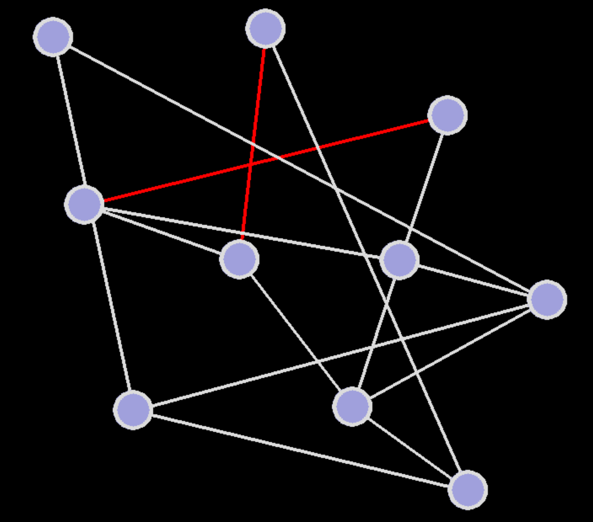

# Planarity (Python Version)

[Planarity](https://en.wikipedia.org/wiki/Planarity) is a graph geometry game, [originally implemented in Flash](http://planarity.net/) by John Tantalo, based on a concept by Mary Radcliffe. This version is implemented in [PyGame](https://www.pygame.org/).

There is an [elegant implementation](https://www.jasondavies.com/planarity/) in JavaScript by Jason Davies, as well as a GTK+ [desktop version](http://web.mit.edu/xiphmont/Public/gPlanarity.html) by Chris Montgomery of Xiph.org.

## Setup

Assuming you have [Python 3](https://www.python.org/) and [pipenv](https://pipenv-fork.readthedocs.io/en/latest/) installed,

* `pipenv install`
* `pipenv run python3 planarity.py`

If you have already installed PyGame into your global environment, then you probably just want,

* `python3 planarity.py`
